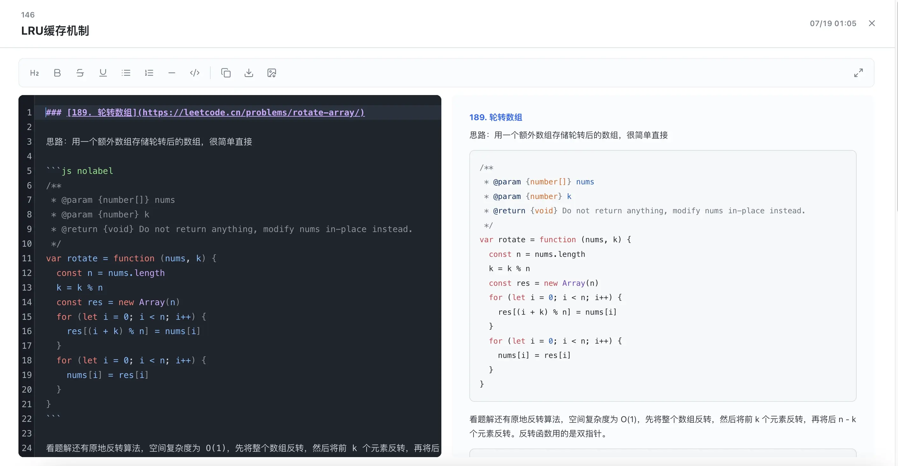
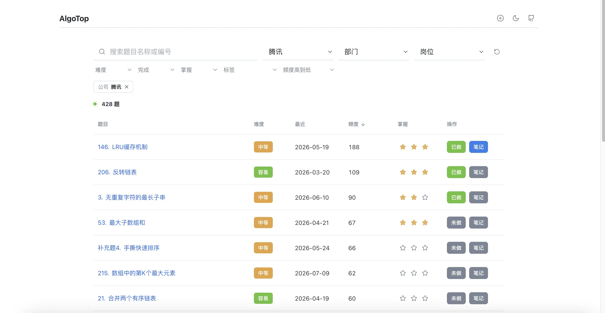

<div align="center">

# AlgoTop

**算法高频题库 · 轻量刷题记录工具**

[GitHub](https://github.com/dogxii/algoTop) · [个人主页](https://dogxi.me) · [报告问题](https://github.com/dogxii/algoTop/issues) · [功能建议](https://github.com/dogxii/algoTop/issues)


</div>

---

## 简介

AlgoTop 是一个面向算法面试准备的本地刷题工具。题库数据、筛选状态、刷题进度和笔记都存储在浏览器本地，打开即可使用。项目仍在火热开发中，所以有更好的建议或想法，欢迎提交 [issue](https://github.com/dogxii/algoTop/issues) ！

## 预览

<div align="center">
  
  
</div>

## 功能

- 高频题库：公司、部门、岗位、难度、标签、最近考察等筛选
- 刷题记录：完成状态、掌握程度、筛选缓存
- 笔记系统：Markdown 编辑、实时预览、代码高亮
- 导出能力：笔记导出 Markdown / 图片
- 本地优先：前端运行时读取本地数据，不依赖站点接口
- 体验细节：亮暗色模式、移动端适配、轻量交互

## 快速开始

```bash
git clone https://github.com/dogxii/algoTop.git
cd algoTop

bun install
bun run dev
```

访问 [http://localhost:5173](http://localhost:5173)

## 常用命令

```bash
bun run dev
bun run build
bun run lint
```

## 数据

题库数据位于 `public/data/codetop.json`，页面运行时只读取本地数据文件。

用户数据保存在浏览器本地：

- 刷题进度
- 掌握程度
- 笔记内容
- 筛选偏好

## GitHub 同步

```bash
cp .env.example .env.local
```

使用 GitHub OAuth App 登录，授权 `gist` scope 后同步到你的 Gist。

```bash
VITE_GITHUB_CLIENT_ID=your_oauth_client_id
VITE_GITHUB_TOKEN_ENDPOINT=/api/github/oauth

GITHUB_CLIENT_ID=your_oauth_client_id
GITHUB_CLIENT_SECRET=your_oauth_client_secret
```

`GITHUB_CLIENT_SECRET` 只配置在部署平台的服务端环境变量中。

Cloudflare Pages 需要在项目环境变量中配置：

- `VITE_GITHUB_CLIENT_ID`
- `GITHUB_CLIENT_ID`
- `GITHUB_CLIENT_SECRET`

项目已包含 Pages Functions：`/functions/api/github/oauth.ts`。

## License

[MIT](LICENSE) © 2026 Dogxi

## 来源

该项目灵感及数据来源：[CodeTop](https://codetop.cc)，感谢 CodeTop 提供的高质量题库数据！
